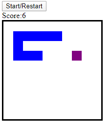
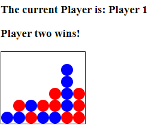
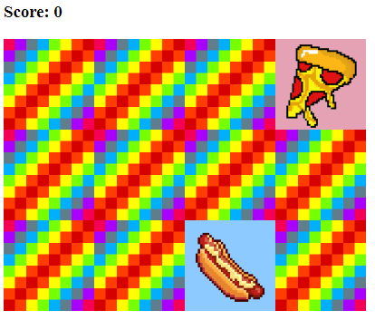

# My personal GitHub 

In this page you can follow my activity on GitHub.

Repositories created by me, forks from other repositories...

## Forks from other repositories

### Nokia3310-Snake

**Nokia3310-Snake** is a fork from kubowania/connect-four

Here you have the url to the repository:
[Nokia3310-Snake](https://github.com/ignacio-villarejo-galan/Nokia3310-Snake) 

### Nokia3310-Snake

**Connect-four** is a fork from kubowania/connect-four

Here you have the url to the repository:
[Connect-four](https://github.com/ignacio-villarejo-galan/connect-four) 

### Memory game

**Memory-game** is a fork from kubowania/memory-game

Here you have the url to the repository:
[Memory-game](https://github.com/ignacio-villarejo-galan/memory-game) 

## Support or Contact

You can contact me through my email: ignacio.villarejo.galan@gmail.com
